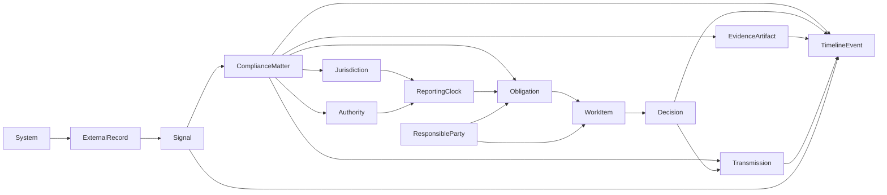
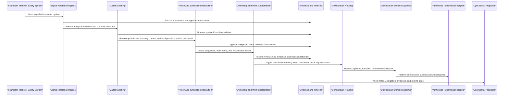
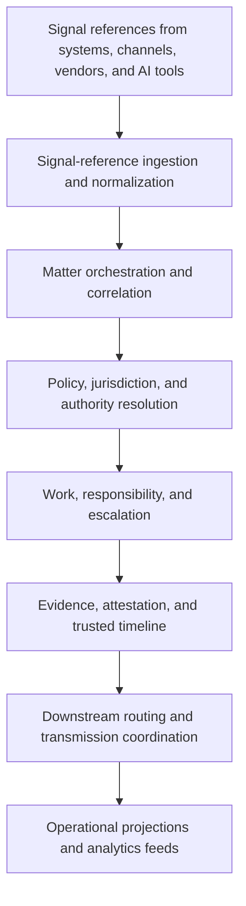

# Sentinel Pharma Control Plane System Design v1

Status: `draft - aligned to overlay story`

Package root:

- `docs/vision/pharma-control-plane/README.md`

## Design Thesis

The system design should assume that existing enterprise tools already do many local jobs well.

Sentinel therefore should not be designed as:

- a new safety suite
- a new RIM suite
- a new eQMS
- a new authority gateway stack
- a new BI layer
- a generic workflow engine with no domain core

It should be designed as a narrow overlay that owns coordination state across:

- systems
- domains
- jurisdictions
- responsible parties
- evidence
- decisions
- downstream routing

### Overlay boundary test

The design is staying honest if these statements remain true:

- if someone asks where the authoritative case, submission, quality event, or clinical object lives, the answer is still an incumbent system
- if Sentinel disappears, the domain systems still function, but cross-system ownership, obligation tracking, and evidence reconstruction get worse
- if a submission to an authority must occur, the execution still flows through the incumbent system or gateway that already owns it

## Canonical First Proof Workflow

Every first-version design decision should be tested against one proving scenario:

- a safety-relevant issue is already captured in an incumbent intake or safety system
- initial triage shows that follow-up may affect more than one market
- global safety operations and at least one local affiliate now share responsibility
- a downstream update to another incumbent system may be required
- the organization would otherwise manage ownership, due-state, and evidence through a mix of system notes, email, spreadsheets, and meetings

If a proposed type, service boundary, or workflow step does not help Sentinel coordinate that scenario better, it is probably not first-version scope.

## Three Truths

### 1. Source truth

The authoritative domain record that already lives in a source platform:

- safety case
- submission record
- clinical record
- quality event
- governance asset
- partner transaction

### 2. Sentinel compliance truth

The orchestration truth Sentinel should own:

- what signal was received
- what matter it belongs to
- what obligations exist
- which jurisdiction and authority are involved
- who is accountable locally and globally
- what evidence supports the path
- what decision was made
- what must be routed downstream

### 3. Analytics and presentation truth

The projections used by:

- operators
- reviewers
- management
- BI tools
- monitoring systems

The design rule is simple:

Sentinel governs the compliance envelope around the problem rather than cloning each upstream record system.

## Core Orchestration Root

The central orchestration root should be:

```text
ComplianceMatter
```

A `ComplianceMatter` is the governed thread that links:

- the incoming signal
- related external records
- affected compliance subjects
- obligations and reporting clocks
- responsible parties
- work items
- evidence artifacts
- decisions
- transmissions
- the append-only timeline

In the first wedge, a `ComplianceMatter` is not every compliance object in the enterprise.

It is the post-intake coordination thread opened when a captured signal requires cross-system or cross-jurisdiction follow-up.

Without a matter model, the system will collapse back into disconnected request records.

## Domain Kernel

| Type | Role in the model |
|---|---|
| `System` | Identifies an internal or external system that produces, stores, or receives compliance-relevant information |
| `ExternalRecord` | References a source-system record without recreating the full source schema |
| `ComplianceSubject` | Represents the thing affected, such as a product, study, site, patient case, submission, lot, market, or partner transaction |
| `Signal` | A normalized indication that may require compliance attention |
| `ComplianceMatter` | The governed thread that groups related signals, obligations, evidence, work, decisions, and transmissions |
| `Jurisdiction` | The market or legal territory whose rules affect the matter |
| `Authority` | The regulator or official body whose processes or reporting expectations apply |
| `LocalRequirement` | A jurisdiction- or authority-specific rule, obligation source, or process expectation; in the first workflow this should usually begin as configuration rather than a separate aggregate |
| `ReportingClock` | The specific time-bound obligation derived from a requirement and event context |
| `ResponsibleParty` | The locally or globally accountable organization, person, or vendor role for a given obligation or transmission |
| `PolicyControl` | The policy, regulation, or internal control objective that justifies an obligation or decision path |
| `Obligation` | A required action, deadline, or reporting expectation derived from policy and local requirements |
| `WorkItem` | An assignable unit of work for a person, team, or service |
| `Decision` | A governed outcome such as confirm, reject, escalate, submit, request follow-up, or close |
| `EvidenceArtifact` | A document, attachment, note, trace, message, model output, or derived artifact that supports the matter |
| `Transmission` | A coordinated outbound update, submission, or handoff to a downstream system, partner, or authority-facing route |
| `DuplicateLinkage` | Links records or signals that may represent the same real-world event across systems or jurisdictions |
| `TimelineEvent` | The append-only event stream across intake, matching, obligations, work, evidence, decisions, and transmissions |
| `Actor` | A human, service account, or AI-assisted worker participating in the matter |
| `Role` | The capacity in which an actor participates |
| `Team` | The organizational group accountable for work or decisions |

### Day-one priority subset

The full kernel above is the conceptual envelope.

The first workflow only needs a narrower subset to prove the wedge:

- `System`
- `ExternalRecord`
- `Signal`
- `ComplianceMatter`
- `Jurisdiction`
- `Authority`
- `ReportingClock`
- `ResponsibleParty`
- `Obligation`
- `WorkItem`
- `Decision`
- `EvidenceArtifact`
- `Transmission`
- `TimelineEvent`

Types such as `ComplianceSubject`, `LocalRequirement`, `PolicyControl`, `DuplicateLinkage`, and richer role modeling should only become first-version requirements if the chosen workflow genuinely needs them.

If a concept can begin as reference data, configuration, or metadata attached to one of the day-one types, it should not become its own first-version aggregate by default.

## Day-One Domain Relationship Diagram



Interpretation:

This diagram is intentionally smaller than the full conceptual envelope. It shows only the shared state the first workflow needs in order to move from captured signal to matter to jurisdiction-aware obligation to accountable action while the authoritative records remain elsewhere.

## Design Non-Goals

The model should explicitly avoid first-version expansion into:

- full authority submission transport stacks
- full safety-case data models
- full regulatory object models
- full clinical data models
- generalized cross-enterprise master-data ownership
- analytics warehouse replacement
- primary intake capture
- medical coding
- full case authoring
- full quality investigation execution

Those may be integrated with or referenced, but they should not be the first ownership boundary.

## Day-One Workflow Boundary

The first system-design target should match the product wedge exactly.

Sentinel starts when:

- a safety-relevant signal, product concern, or adjacent issue has already been captured in an incumbent intake or safety system
- initial triage indicates that follow-up work may cross teams, systems, or jurisdictions
- the issue now requires explicit ownership, due-state, and evidence tracking outside the source system's native flow

Sentinel ends when:

- required downstream updates, notifications, or routed submissions have been coordinated
- the decision and evidence path is preserved in one inspectable thread

Sentinel should not own:

- primary intake capture
- case authoring
- medical coding
- authority gateway execution
- full quality investigation management

### Day-one hardening rules

The first implementation should stay inside these constraints:

- prove value with `1` source system and `1` downstream target
- prefer configuration-backed clock and rule resolution over a broad regulatory-content engine
- do not build generalized routing or workflow infrastructure beyond what the chosen matter needs
- do not add a new aggregate unless it changes an operator answer in the workspace
- if provenance cannot support an AI-compressed explanation, show raw state and evidence instead

These are product constraints, not implementation inconveniences.

## PV-First Workflow Sequence



Interpretation:

The most important rule in this sequence is the handoff boundary. Sentinel coordinates what must happen and preserves the evidence trail, but the authoritative downstream action still occurs through the systems that already own case processing, submission, or quality execution.

If the first implementation cannot demonstrate this sequence cleanly for one recurring post-intake safety matter, the design is still too broad.

## Distinctness Test

The day-one design is only distinct enough if these remain true:

- removing graph mode does not remove the product's value
- improving dashboards alone would still not solve the operator problem
- the workspace depends on stable coordination-state primitives, not customer-specific tickets and fields
- the first proof can show a better governed thread without pretending to replace the source systems

If those statements stop being true, the design is drifting back toward generic workflow or reporting.

## Operational Capability Stack



Interpretation:

The product wedge is operationally meaningful only when these layers are connected narrowly around the chosen workflow. A system that only normalizes signals, or only automates workflow, will not be enough, but neither will a design that tries to implement each layer at enterprise-wide breadth on day one.

## Ownership Rules

Sentinel should own coordination state such as:

- normalized signals
- compliance matters
- local and global obligation state
- reporting clocks
- responsibility assignments
- work and escalation state
- evidence and attestation
- decisions
- duplicate linkage
- routing and transmission coordination
- trusted timelines

Sentinel should reference, not fully re-host:

- source-system master records
- detailed safety-case models
- detailed regulatory record models
- detailed clinical trial data
- downstream submission archives
- enterprise analytics datasets

Sentinel should not own:

- primary intake capture
- case authoring or coding
- source-system master records
- authority submission transport execution
- full quality investigation execution

## PV-First Example Mapping

In a PV-first implementation, the day-one kernel could look like this for the canonical proof workflow:

- `Signal`
  - a safety-relevant signal already captured in a safety or intake system, such as adverse-event intake, product concern, follow-up, quality complaint, or trial-derived safety issue
- `ComplianceMatter`
  - one governed thread for the post-intake follow-up and decision path around that issue
- `Jurisdiction`
  - EU, US, UK, Japan, Australia, Canada, Switzerland, China
- `Authority`
  - EMA, FDA, MHRA, PMDA, TGA, Health Canada, Swissmedic, NMPA
- `LocalRequirement`
  - local case-reporting rule, signal-management expectation, field alert requirement, masking rule, RMP-linked action
- `ReportingClock`
  - 3-day, 7-day, 15-day, periodic, or other authority-specific due windows
- `ResponsibleParty`
  - local affiliate safety lead, global safety operations, QPPV-like function, partner organization, external processor
- `Transmission`
  - requested update to a safety system, handoff to a regulatory route, routed submission request through an incumbent system, or internal escalation notice

### First proof questions

The first build should be able to answer, for one recurring matter type:

- who owns this matter right now
- which clocks are active
- which downstream actions are still open
- what evidence supports the current decision
- which incumbent systems have already acted and which have not

## Bridge to the Current Sentinel Foundation

Current Sentinel Phase A already proves useful substrate behavior:

- durable ingestion
- replay-safe asynchronous processing
- append-only audit evidence
- request status and history reads
- operational readiness and verifier-backed confidence

That should now be interpreted as the transport-and-evidence foundation for the future control plane.

The next upward layers are:

- `ComplianceMatter`
- `Obligation`
- `Jurisdiction`
- `Authority`
- `ResponsibleParty`
- `Decision`
- `Transmission`
- richer projections and operational APIs

## State Separation

The design should keep at least three state layers separate.

### 1. Backbone transport truth

- `accepted`
- `processed`
- `failed`

### 2. Human workflow truth

- ready for review
- in review
- escalated
- approved
- rejected
- closed

### 3. Regulatory or jurisdictional obligation truth

- clock started
- action due
- routed
- submitted
- acknowledged
- overdue

Keeping those layers separate avoids overloading infrastructure state with business or regulatory meaning.

## Practical Design Constraint

If the domain model cannot answer these questions, the wedge is probably too weak:

- Which matter is this event part of?
- Which markets and authorities are affected?
- Which obligations and clocks now apply?
- Who is accountable locally and globally?
- What evidence supports the next decision?
- Which downstream systems or routes must be updated?

If the answer requires inventing new core nouns for every buyer, the wedge is probably drifting into services.

Those questions are the real justification for building Sentinel as a coordination overlay instead of as another workflow app.
