# Sentinel Pharma Control Plane Vision v1

Status: `draft`

Package root:

- `docs/vision/pharma-control-plane/README.md`

## Defensible Thesis

Sentinel should evolve into a pharma-first compliance control plane for the governed thread across systems, domains, and jurisdictions.

That is a narrower claim than "unify compliance" and a more defensible one.

Sentinel should not try to replace:

- safety case-processing suites
- RIM suites
- EDC and clinical-data platforms
- eQMS systems
- EDI networks
- BI platforms
- generic enterprise workflow or GRC platforms

Instead, Sentinel should own the thin but high-value layer that many of those tools do not fully own together:

- normalize incoming signals
- open and track cross-system compliance matters
- derive obligations and reporting clocks
- coordinate human and AI-assisted work
- preserve evidence and attestation
- route downstream updates and transmissions
- expose trusted projections for operations and analytics

## Target Customer Archetype

The most credible early customer is a top-20 pharma sponsor with:

- products or studies operating across multiple jurisdictions
- serious existing software in PV, regulatory, clinical, quality, governance, and analytics
- outsourced or distributed operating models across affiliates, vendors, CROs, or service partners
- growing use of AI-assisted intake, triage, summarization, or workflow acceleration

This customer likely already has strong systems in place.

The friction comes from the gaps between them:

- signals arrive through different channels and systems
- one event can trigger obligations in multiple domains
- local and global responsibilities are split
- evidence lives in multiple platforms
- reporting clocks vary by market and event type
- AI improves speed but increases the need for provenance and review governance

## What Existing Tools Already Do Well

The current market is not missing serious software.

Examples:

- [Veeva RIM](https://www.veeva.com/products/veeva-rim/) is strong at registrations, submissions, publishing, and regulatory lifecycle coordination.
- [Veeva Safety](https://www.veeva.com/products/veeva-safety/) is strong at adverse-event intake, case processing, submission, and connected safety operations.
- [ArisGlobal LifeSphere Safety](https://www.arisglobal.com/lifesphere/safety/) is strong at end-to-end safety operations, reporting, and AI-assisted safety workflows.
- [Medidata Rave EDC](https://www.medidata.com/en/clinical-trial-products/clinical-data-management/edc-systems/) is strong at compliant clinical-data capture and trial execution.
- [Informatica Cloud Data Governance and Catalog](https://www.informatica.com/products/data-governance/cloud-data-governance-and-catalog.html) is strong at governance, lineage, catalog, and data/AI trust controls.
- [TrueCommerce](https://www.truecommerce.com/products/edi-software/fully-managed-service/) is strong at managed EDI operations and partner connectivity.
- [Power BI](https://www.microsoft.com/en-us/power-platform/products/power-bi) and [KNIME](https://www.knime.com/knime-for-enterprise) are strong at analytics, automation, workflows, and operational visibility.
- [ServiceNow IRM](https://www.servicenow.com/products/integrated-risk-management.html) and [MetricStream Connected GRC](https://www.metricstream.com/products/connected-grc.htm) are strong at broad workflow, risk, and policy orchestration inside enterprise governance programs.

The devil's-advocate lesson is important:

Sentinel should not pitch itself as "better software" for each of those domains.

The more credible position is:

when those systems each do their jobs well, Sentinel becomes the control plane for the governed thread that spans them.

## Where Sentinel Matters

Sentinel is most likely to matter when all of these are true:

- the company already has multiple best-of-breed systems
- work crosses domain boundaries such as PV, quality, regulatory, and clinical
- obligations vary by country or authority
- local and global teams need a shared evidence and decision thread
- downstream communications or submissions must be coordinated
- leadership wants operational truth without rebuilding every source system

In other words, Sentinel matters when the company has enough maturity that the main pain is orchestration, not basic system absence.

## Where Sentinel May Be Unnecessary

Sentinel may be a weak fit if:

- one suite already covers the needed workflow well enough end to end
- the primary problem is only case processing
- the primary problem is only BI and dashboarding
- the organization already built a strong internal cross-system control layer

That constraint should stay attached to the product story. It makes the wedge narrower, but more believable.

## PV-First Wedge

The first wedge should still be pharmacovigilance and adjacent safety work.

That wedge remains attractive because it combines:

- multi-channel intake
- strict and varied reporting clocks
- local and global accountability
- evidence-heavy review and attestation
- downstream safety, regulatory, and quality implications
- heavy pressure to use AI without sacrificing auditability

The key is to define the wedge correctly.

Sentinel should not position itself as another safety suite.

It should position itself as the layer that governs the thread around safety-relevant work when the enterprise already has:

- safety systems
- trial systems
- regulatory systems
- quality systems
- analytics and automation tools

[Lilly's patient-safety materials](https://www.lilly.com/medicines/safety/patient-safety) describe pharmacovigilance as the collection, monitoring, evaluation, and reporting of safety information, including adverse-event collection, signal management, and reporting to regulatory authorities. That is a good anchor because it shows how broad the operating problem already is before you even consider internal enterprise fragmentation.

Lilly also publicly describes structured product-concern reporting at [How to Report a Lilly Product Concern](https://www.lilly.com/medicines/report-product-concern?lang=EN&country=US), which reinforces that intake is only the front edge of a larger governed workflow.

As supporting industry context, a [CIO case study on Eli Lilly's MosaicPV initiative](https://www.cio.com/article/202182/eli-lilly-ai-automates-adverse-reaction-reporting.html) describes AI-assisted adverse-event processing, faster triage, and structured ingestion from varied sources. The relevant lesson for Sentinel is not "build the same thing." The lesson is that enterprises are already trying to accelerate intake and triage, which increases the need for cross-system governance and traceable decisioning.

## Why the International Layer Strengthens the Wedge

The international market makes the control-plane story stronger, not weaker, if the story stays narrow.

There is real harmonisation through [ICH implementation guidance](https://admin.ich.org/page/ich-guideline-implementation), [ICH E2D(R1)](https://database.ich.org/sites/default/files/ICH_E2D%28R1%29_Step4_FinalGuideline_2025_0819.pdf), and [ICH E2B(R3) Q&As](https://database.ich.org/sites/default/files/ICH_E2B-R3_QA_v2_4_Step4_2022_1202.pdf).

But implementation remains regional and local:

- [EMA GVP](https://www.ema.europa.eu/en/human-regulatory-overview/post-authorisation/pharmacovigilance-post-authorisation/good-pharmacovigilance-practices-gvp)
- [FDA electronic safety submissions](https://www.fda.gov/drugs/fda-adverse-event-monitoring-system-aems/fda-adverse-event-monitoring-system-aems-electronic-submissions)
- [MHRA GPvP](https://www.gov.uk/guidance/good-pharmacovigilance-practice-gpvp)
- [TGA sponsor responsibilities](https://www.tga.gov.au/resources/guidance/pharmacovigilance-responsibilities-medicine-sponsors)
- [Health Canada industry reporting](https://www.canada.ca/en/health-canada/services/drugs-health-products/medeffect-canada/adverse-reaction-reporting/drug/industry.html)
- [PMDA Risk Management Plan](https://www.pmda.go.jp/english/safety/info-services/drugs/rmp/0001.html)
- [Swissmedic ElViS](https://www.swissmedic.ch/swissmedic/en/home/services/egov-services/elvis.html)
- [NMPA ADR monitoring](https://english.nmpa.gov.cn/2019-07/19/c_389171.htm)

The practical implication is that large pharma companies do not just manage "cases." They manage:

- different authorities
- different reporting channels
- different deadlines
- local and global responsible parties
- local labeling or risk-communication impacts
- duplicate-prevention across systems and markets
- evidence that has to survive inspection in different jurisdictions

That is exactly the kind of complexity a control plane can help coordinate without becoming the authority-facing system of record itself.

## The Core Value Claims

If Sentinel is credible, it is credible because of six things.

### 1. One cross-system matter thread

Sentinel groups signals, obligations, evidence, work, and decisions into a single compliance matter even when the underlying records live elsewhere.

### 2. One obligation engine across domains and jurisdictions

Sentinel derives what must happen, by when, under which rule, and for which authority or market.

### 3. One evidence and attestation thread

Sentinel preserves the decision path in a way that is easier to inspect than stitching together workflow history across many systems.

### 4. One coordination layer for humans and AI

Sentinel governs AI-assisted intake and triage instead of merely adding more automation without stronger control.

### 5. One routing layer for downstream actions

Sentinel coordinates updates, handoffs, and transmissions to the systems and teams that still own the authoritative domain action.

### 6. One analytics-ready operational truth

Sentinel gives operational teams and BI tools cleaner projections than raw source-system events usually provide on their own.

## Context Diagram

```mermaid
flowchart LR
    subgraph Sources["Source Systems and Channels"]
        Safety["Safety Suites"]
        RIM["RIM / Regulatory Systems"]
        Clinical["Clinical / Trial Platforms"]
        Quality["Quality / eQMS Systems"]
        Gov["Governance / AI Governance Tools"]
        Partner["EDI / Partner Exchange"]
        Intake["Call Center / Email / Intake Channels"]
        AI["AI Intake and Triage Tools"]
    end

    subgraph Sentinel["Sentinel Compliance Control Plane"]
        Normalize["Signal Normalization"]
        Matter["Cross-System Compliance Matter"]
        Obligation["Obligation and Reporting Clock Engine"]
        Workflow["Human and AI-Governed Workflow"]
        Evidence["Evidence, Attestation, and Trusted Timeline"]
        Route["Downstream Routing and Projections"]
    end

    subgraph Consumers["Consumers and Targets"]
        Teams["Local and Global Operating Teams"]
        Authorities["Authority-Facing Systems and Submission Targets"]
        Analytics["Power BI / KNIME / Monitoring"]
    end

    Sources --> Normalize
    Normalize --> Matter
    Matter --> Obligation
    Obligation --> Workflow
    Workflow --> Evidence
    Evidence --> Route
    Route --> Teams
    Route --> Authorities
    Route --> Analytics
```

Interpretation:

Sentinel does not replace the surrounding software landscape. It turns a fragmented operating environment into a governed thread that can be owned, inspected, and acted on.

## Product Boundary

Sentinel should own:

- signals
- compliance matters
- obligations
- work state
- decisions and attestations
- evidence and provenance
- trusted timelines
- downstream routing state

Sentinel should reference rather than fully own:

- source-system records
- case details already mastered elsewhere
- clinical records
- full regulatory objects
- quality records
- BI datasets

Sentinel should avoid becoming:

- a full safety database
- a regulatory publishing platform
- a clinical system of record
- an authority gateway stack
- a generic workflow platform

## Expansion Path Beyond PV

The expansion path should stay deliberate:

1. PV and safety-adjacent signal orchestration
2. regulatory-change and submission-adjacent coordination
3. clinical-quality and deviation workflows
4. partner-exchange and supply-chain compliance events
5. broader cross-domain compliance control-plane behavior

The expansion logic is the same in every step:

Sentinel owns the governed thread across systems, not the full record system inside each domain.

## References

- [Veeva RIM](https://www.veeva.com/products/veeva-rim/)
- [Veeva Safety](https://www.veeva.com/products/veeva-safety/)
- [ArisGlobal LifeSphere Safety](https://www.arisglobal.com/lifesphere/safety/)
- [Medidata Rave EDC](https://www.medidata.com/en/clinical-trial-products/clinical-data-management/edc-systems/)
- [Informatica Cloud Data Governance and Catalog](https://www.informatica.com/products/data-governance/cloud-data-governance-and-catalog.html)
- [TrueCommerce Fully Managed EDI](https://www.truecommerce.com/products/edi-software/fully-managed-service/)
- [Microsoft Power BI](https://www.microsoft.com/en-us/power-platform/products/power-bi)
- [KNIME for Enterprise](https://www.knime.com/knime-for-enterprise)
- [ServiceNow Integrated Risk Management](https://www.servicenow.com/products/integrated-risk-management.html)
- [MetricStream Connected GRC](https://www.metricstream.com/products/connected-grc.htm)
- [Lilly Patient Safety](https://www.lilly.com/medicines/safety/patient-safety)
- [Lilly Product Concern Reporting](https://www.lilly.com/medicines/report-product-concern?lang=EN&country=US)
- [CIO: Eli Lilly AI automates adverse reaction reporting](https://www.cio.com/article/202182/eli-lilly-ai-automates-adverse-reaction-reporting.html)
- [ICH Guideline Implementation](https://admin.ich.org/page/ich-guideline-implementation)
- [EMA Good Pharmacovigilance Practices](https://www.ema.europa.eu/en/human-regulatory-overview/post-authorisation/pharmacovigilance-post-authorisation/good-pharmacovigilance-practices-gvp)
- [FDA AEMS / FAERS Electronic Submissions](https://www.fda.gov/drugs/fda-adverse-event-monitoring-system-aems/fda-adverse-event-monitoring-system-aems-electronic-submissions)
- [MHRA Good Pharmacovigilance Practice](https://www.gov.uk/guidance/good-pharmacovigilance-practice-gpvp)
- [TGA Pharmacovigilance Responsibilities of Medicine Sponsors](https://www.tga.gov.au/resources/guidance/pharmacovigilance-responsibilities-medicine-sponsors)
- [Health Canada Industry Adverse Reaction Reporting](https://www.canada.ca/en/health-canada/services/drugs-health-products/medeffect-canada/adverse-reaction-reporting/drug/industry.html)
- [PMDA Risk Management Plan](https://www.pmda.go.jp/english/safety/info-services/drugs/rmp/0001.html)
- [Swissmedic ElViS](https://www.swissmedic.ch/swissmedic/en/home/services/egov-services/elvis.html)
- [NMPA National Center for ADR Monitoring](https://english.nmpa.gov.cn/2019-07/19/c_389171.htm)
