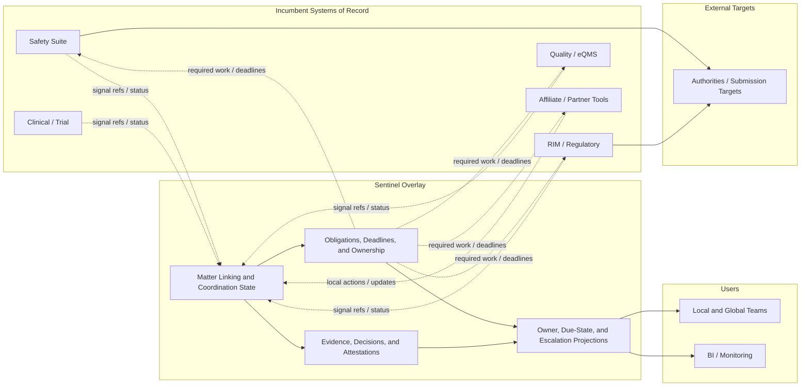

# Sentinel Pharma Control Plane Vision v1

Status: `draft - redlined`

Package root:

- `docs/vision/pharma-control-plane/README.md`

Preserved pre-redline snapshot:

- `docs/vision/pharma-control-plane/current/v1/vision-pre-redline.md`

## Defensible Entry Thesis

Sentinel's first credible position is not "pharma compliance control plane" in the abstract.

It is this:

Sentinel coordinates a governed compliance matter when required work spans incumbent systems, teams, and jurisdictions.

That is narrower than "unify compliance," and it is more believable.

For the first wedge, Sentinel should not try to become:

- a safety case-processing suite
- a RIM suite
- an EDC or clinical-data platform
- an eQMS
- an authority gateway stack
- a BI platform
- a generic workflow or GRC platform

The first product should instead own a thinner layer:

- open or link a shared `ComplianceMatter`
- derive obligations, deadlines, and responsible parties
- preserve evidence, decisions, and attestations across handoffs
- coordinate downstream actions while authoritative systems stay in place
- expose projections that show current owner, due state, and inspection-ready history

## Initial Buyer Shape

The most plausible early buyer is not "any large pharma company."

It is a multinational sponsor or large biotech that has already invested in core systems and is now paying for the gaps between them.

The first credible sponsor is likely one of these:

- a global safety-operations leader
- a pharmacovigilance systems or operations-transformation leader
- a regulatory-operations leader as a secondary stakeholder when safety follow-up and local-market obligations are visibly entangled

The daily users are likely to be:

- global safety operations teams
- local safety affiliates or outsourced partners
- regulatory coordinators when follow-up crosses into regulatory obligations
- quality or product-complaint liaisons only when the same matter triggers downstream quality action

That buyer usually already has:

- a safety platform
- at least one regulatory, quality, or clinical platform
- distributed local and global operating teams
- outside affiliates, vendors, CROs, or service partners
- growing pressure to automate intake, triage, or follow-up work

### Observable pain signals

This buyer is only interesting when the pain is visible in daily operations.

Examples:

- people still ask "who owns this now?" after a signal has already been captured
- due dates or reporting clocks are tracked outside the main systems
- local and global teams reconstruct status through email, spreadsheets, or meetings
- evidence for one decision has to be stitched together from multiple platforms
- leadership wants one trustworthy status view, but no existing system can provide it without custom reporting and manual reconciliation

### Anti-buyer signals

This is probably not the right early buyer if:

- the company is still choosing or rolling out its first safety suite
- the main request is to replace case-processing software
- the main pain is just dashboarding
- the organization is small enough that cross-system coordination rarely becomes a real operational burden

## Canonical First Proof Workflow

Every first-version claim in this document should be read through one concrete proving case.

That proving case is:

- a safety-relevant issue has already been captured in an incumbent intake or safety system
- initial triage shows that follow-up may affect more than one market
- global safety operations and at least one local affiliate now share responsibility
- a downstream update to another incumbent system may be required
- the current organization would otherwise manage ownership, due-state, and evidence through a mix of system notes, email, spreadsheets, and meetings

Sentinel wins only if it can make that one situation materially easier to coordinate without replacing the systems that captured or will ultimately process the underlying domain work.

## What Existing Tools Already Do Well

The market is not missing serious software.

Examples:

- [Veeva RIM](https://www.veeva.com/products/veeva-rim/) is strong at registrations, submissions, publishing, and regulatory lifecycle coordination.
- [Veeva Safety](https://www.veeva.com/products/veeva-safety/) is strong at adverse-event intake, case processing, submission, and connected safety operations.
- [ArisGlobal LifeSphere Safety](https://www.arisglobal.com/lifesphere/safety/) is strong at end-to-end safety operations, reporting, and AI-assisted safety workflows.
- [Medidata Rave EDC](https://www.medidata.com/en/clinical-trial-products/clinical-data-management/edc-systems/) is strong at compliant clinical-data capture and trial execution.
- [Informatica Cloud Data Governance and Catalog](https://www.informatica.com/products/data-governance/cloud-data-governance-and-catalog.html) is strong at governance, lineage, catalog, and data/AI trust controls.
- [TrueCommerce](https://www.truecommerce.com/products/edi-software/fully-managed-service/) is strong at managed EDI operations and partner connectivity.
- [Power BI](https://www.microsoft.com/en-us/power-platform/products/power-bi) and [KNIME](https://www.knime.com/knime-for-enterprise) are strong at analytics, automation, workflows, and operational visibility.
- [ServiceNow IRM](https://www.servicenow.com/products/integrated-risk-management.html) and [MetricStream Connected GRC](https://www.metricstream.com/products/connected-grc.htm) are strong at broad workflow, risk, and policy orchestration inside enterprise governance programs.

The devil's-advocate lesson is simple:

Sentinel should not market itself as better domain software for those categories.

The defensible position is narrower:

when those systems each do their own jobs well, Sentinel owns the governed thread between them.

## The Wedge Sentinel Actually Owns

Sentinel should not claim to unify all compliance data.

It should claim to own the coordination-state layer that breaks down when one issue crosses system boundaries.

That layer is made of a small set of primitives:

- `Signal`
- `ComplianceMatter`
- `Obligation`
- `ReportingClock`
- `WorkItem`
- `Decision`
- `EvidenceArtifact`
- `Transmission`
- `TimelineEvent`

These are not just conceptual nouns.

They are the minimum shared state Sentinel needs in order to answer:

- what issue are we coordinating
- what must happen next
- by when
- who owns it now
- what decision was made
- what evidence supports it
- what downstream actions are still open

That is the productizable core of the wedge.

If those primitives cannot stay stable across buyers, the wedge will collapse into services.

The first release should prove that this same model can survive at least a few closely related workflows without inventing a new core noun every time.

## The Wedge Only Survives If

The current product story is only worth continuing if all of these remain true at the same time:

- one recurring matter type can be named without turning each example into a different story
- the operator workspace answers owner, clock, block, downstream state, and decision-basis questions better than dashboards or ticket queues
- the first proof shows value with one source system and one downstream target, not after a broad integration program
- the same core primitives remain stable across repeated matters
- the product still feels valuable if the graph view is removed
- the product still feels valuable if AI summaries are turned off and only provenance-backed state remains

If those conditions stop being true, Sentinel is no longer a distinct product wedge.

## Where Sentinel Matters

For the first product, Sentinel matters when the canonical proof workflow is real and most of these conditions are true at the same time:

- one captured safety-relevant issue triggers follow-up across at least two teams and at least two systems
- no single system cleanly answers what is due, who owns it, and what evidence supports the last decision
- local-market or authority-specific differences change deadlines, routing, or accountability
- downstream updates, notifications, or routed submissions must be coordinated across more than one team
- the buyer can point to recurring manual status reconciliation, spreadsheet tracking, or handoff meetings around this workflow
- missed or near-missed obligations, unclear ownership, or inspection-prep burden are already recognized as real operating risk
- a sponsor with budget or authority actually wants an overlay, not a rip-and-replace program

In other words, Sentinel matters when the company's pain is not missing software, but losing control at the edges between software systems.

## Where Sentinel Probably Loses

Sentinel is likely a weak fit when:

- one suite already covers the workflow well enough end to end
- the company is still trying to finish its first major platform rollout
- the real problem is only case processing
- the real problem is only BI and dashboarding
- the request is really for ETL, warehousing, or reporting cleanup
- the buyer expects Sentinel to replace case-processing or authority-submission systems
- the company already built a strong internal control layer
- the workflow volume is too low to justify another product
- the buyer has no appetite for even a thin integration overlay
- the first workflow cannot be described as one clear recurring coordination failure
- each candidate workflow appears to require a different core data model before the product becomes useful

That constraint should stay attached to the story.

It makes the wedge smaller, but it also makes it more believable.

## First-Product No-Go Conditions

The first product should stop expanding and re-qualify itself if any of these become true:

- no one can name a sponsor, budget path, and approval path at the same time
- the strongest buyer demand is only for dashboards, reporting, or status visibility
- the first proof needs many integrations before the operator workspace becomes useful
- the buyer keeps pulling the story back toward suite replacement
- every serious prospect needs a different core matter model before value appears
- the most compelling part of the demo is the graph or AI summary rather than the matter workspace itself

Those are not small warning signs.

They are indications that the wedge may still be interesting but not productized enough to support a real company.

## PV-First Entry Wedge

The first wedge should be narrower than "pharmacovigilance" as a whole.

The more defensible entry point is:

post-intake safety matter coordination for multi-system, multi-jurisdiction follow-up.

That means Sentinel enters after a safety-relevant signal has already been captured somewhere in the existing stack.

### The day-one workflow boundary

Sentinel should start when:

- a safety-relevant signal, product concern, or adjacent issue has already been captured in an intake or safety system
- initial triage or enrichment suggests that follow-up work may cross teams, systems, or jurisdictions

The recurring problem then becomes:

- triage or enrichment happens in one place
- reportability or follow-up decisions involve other teams
- local and global responsibilities split
- deadlines differ by market and event type
- evidence and approvals scatter across systems
- downstream updates to safety, regulatory, quality, or affiliate teams must still be coordinated

Sentinel should own this part of the workflow:

- open or link the governed matter
- derive obligations, deadlines, and accountable parties
- preserve decisions, evidence, and attestation across handoffs
- coordinate downstream work until required actions are complete or explicitly not required

Sentinel should not own this part of the workflow:

- primary intake capture
- full safety case authoring or case processing
- medical coding
- authority gateway execution
- full quality investigation management

The first workflow should end when:

- the required downstream updates, submissions, notifications, or documented no-action decisions are complete
- the decision and evidence path is preserved in one inspectable thread

That is a better wedge than "AI safety intake" or "new safety platform" because it starts where incumbents often stop owning the whole thread cleanly.

For the first sale, this should still be described as one narrow follow-up problem, not as a whole PV modernization story.

[Lilly's patient-safety materials](https://www.lilly.com/medicines/safety/patient-safety) describe pharmacovigilance as collection, monitoring, evaluation, and reporting across safety information and regulatory authorities. That is a useful anchor because it shows the operating problem is already broader than intake.

Lilly also publicly describes structured product-concern intake at [How to Report a Lilly Product Concern](https://www.lilly.com/medicines/report-product-concern?lang=EN&country=US), reinforcing that intake is only the front edge of a larger governed workflow.

As supporting industry context, a [CIO case study on Eli Lilly's MosaicPV initiative](https://www.cio.com/article/202182/eli-lilly-ai-automates-adverse-reaction-reporting.html) describes AI-assisted intake and faster triage. The relevant lesson for Sentinel is not "build the same thing." The lesson is that faster intake increases pressure on the coordination, evidence, and decision layers that follow.

## Why International Complexity Helps Only If The Coordination Problem Is Already Real

International complexity does not automatically create a product opportunity for Sentinel.

It only strengthens the wedge when the buyer already has real cross-market coordination pain and no clean way to preserve one matter thread across jurisdictions.

The key question is not:

"how do we submit to authority X?"

That question usually points back to incumbent safety, regulatory, or gateway systems.

The key question is:

"once a multi-market issue exists, who owns what, which clocks apply, what evidence supports the decision path, and which downstream systems still need to act?"

There is real harmonisation through [ICH implementation guidance](https://admin.ich.org/page/ich-guideline-implementation), [ICH E2D(R1)](https://database.ich.org/sites/default/files/ICH_E2D%28R1%29_Step4_FinalGuideline_2025_0819.pdf), and [ICH E2B(R3) Q&As](https://database.ich.org/sites/default/files/ICH_E2B-R3_QA_v2_4_Step4_2022_1202.pdf).

But execution still varies across markets and authorities:

- [EMA GVP](https://www.ema.europa.eu/en/human-regulatory-overview/post-authorisation/pharmacovigilance-post-authorisation/good-pharmacovigilance-practices-gvp)
- [FDA electronic safety submissions](https://www.fda.gov/drugs/fda-adverse-event-monitoring-system-aems/fda-adverse-event-monitoring-system-aems-electronic-submissions)
- [MHRA GPvP](https://www.gov.uk/guidance/good-pharmacovigilance-practice-gpvp)
- [TGA sponsor responsibilities](https://www.tga.gov.au/resources/guidance/pharmacovigilance-responsibilities-medicine-sponsors)
- [Health Canada industry reporting](https://www.canada.ca/en/health-canada/services/drugs-health-products/medeffect-canada/adverse-reaction-reporting/drug/industry.html)
- [PMDA Risk Management Plan](https://www.pmda.go.jp/english/safety/info-services/drugs/rmp/0001.html)
- [Swissmedic ElViS](https://www.swissmedic.ch/swissmedic/en/home/services/egov-services/elvis.html)
- [NMPA ADR monitoring](https://english.nmpa.gov.cn/2019-07/19/c_389171.htm)

That creates real coordination burden around:

- reporting clocks
- authority-specific routes
- local and global responsible parties
- duplicate-prevention
- evidence preservation across markets

In the canonical proof workflow, that usually shows up as:

- one matter with different local clocks
- one global team and one local team both touching the same decision path
- one downstream action that is complete in one market and still open in another

That supports a thin coordination overlay that can keep:

- affected jurisdictions and authorities visible on one matter
- obligation clocks explicit
- ownership and escalation state visible
- decision evidence preserved in one thread
- downstream completion state inspectable across markets

It does not justify building:

- a new authority-facing system of record
- a new submission gateway product
- a new global safety database

If the buyer's primary pain is submission formatting, gateway certification, or authority transport, Sentinel is probably the wrong product.

If the buyer's first use case does not cross at least one meaningful jurisdiction boundary, international complexity should not be used as a primary selling point.

## Defensible Value Claims

The most defensible value claims are not "one platform" claims.

They are narrower operating claims.

Sentinel is only credible if it can prove outcomes like these on the canonical proof workflow:

### 1. Less status reconstruction

Sentinel reduces the time teams spend asking multiple systems, inboxes, and spreadsheets who owns an issue and what state it is in.

### 2. Clearer due-state and ownership

Sentinel makes explicit what must happen next, by when, and who owns it under the relevant market or policy context.

### 3. Easier inspection and audit reconstruction

Sentinel makes it easier to inspect why a decision was made and what evidence supported it without reconstructing history from many platforms.

### 4. Safer AI-assisted acceleration

Sentinel treats AI-assisted intake, routing, and summarization as evidence-bearing activity that still requires provenance, review, and policy context.

### 5. Better downstream completion visibility

Sentinel gives operating teams and analytics tools cleaner projections of current owner, due state, escalation state, and downstream completion status across the systems that still perform the underlying domain work.

## Context Diagram

Interpretation:

Sentinel sits beside incumbent systems, not above them as a replacement platform. The authoritative case, regulatory, quality, and clinical records stay in the incumbent stack, and authority-facing submissions still flow through the systems that already own them. Sentinel's job is to preserve the governed coordination state that otherwise gets fragmented between those systems.

## Product Boundary

The simplest boundary test is this:

if a domain team asks, "where is the authoritative record for this case, submission, quality event, or study object?", the answer should still be an incumbent system, not Sentinel.

Sentinel should own coordination state such as:

- signals
- compliance matters
- obligations and reporting clocks
- work state and escalations
- decisions and attestations
- evidence and provenance
- trusted timelines
- downstream routing state

Sentinel may also store supporting coordination artifacts such as:

- references to source-system records
- derived status projections
- evidence pointers, hashes, and attachments needed for the decision trail
- snapshots needed to preserve why a decision was made at a point in time

Sentinel should reference rather than fully own:

- source-system records
- case details already mastered elsewhere
- clinical records
- full regulatory objects
- quality records
- BI datasets

Sentinel should avoid becoming:

- a primary intake capture system
- a full safety database
- a case-authoring or medical-coding system
- a regulatory publishing platform
- a clinical system of record
- an authority gateway stack
- a quality investigation or CAPA system
- a generic workflow platform

### Boundary checks

The product is staying honest if these statements remain true:

- removing Sentinel would make coordination, ownership tracking, and evidence reconstruction worse, but it would not stop the underlying domain systems from functioning
- a regulator or auditor asking for the authoritative domain record would still be directed to the incumbent system of record
- Sentinel can add value without first replacing the buyer's core safety, regulatory, quality, or clinical platforms

## Adjacencies After Proof

Expansion should happen only after the first wedge proves that the same matter and obligation model can stay stable.

Possible adjacencies later:

- regulatory-change and submission-adjacent coordination
- clinical-quality and deviation coordination
- partner or affiliate compliance-event coordination
- broader AI-governance overlays where the same evidence and decision model still holds

These are not launch promises.

They are only believable if the first PV-first wedge works without turning the product into a custom implementation program.

## References

- [Veeva - 4 Insights on PV Transformation](https://www.veeva.com/resources/4-insights-on-pv-transformation/)
- [Veeva - Improve Regulatory Processes with Affiliates and Partners](https://www.veeva.com/blog/increase-affiliate-and-partner-engagement-to-improve-regulatory-processes/)
- [Veeva RIM](https://www.veeva.com/products/veeva-rim/)
- [Veeva Safety](https://www.veeva.com/products/veeva-safety/)
- [ArisGlobal LifeSphere Safety](https://www.arisglobal.com/lifesphere/safety/)
- [ArisGlobal - Regulatory 2025 white paper](https://lifesphere.arisglobal.com/wp-content/uploads/2022/06/LifeSphere_WhitePaper_Regulatory_2025.pdf)
- [Medidata Rave EDC](https://www.medidata.com/en/clinical-trial-products/clinical-data-management/edc-systems/)
- [Informatica Cloud Data Governance and Catalog](https://www.informatica.com/products/data-governance/cloud-data-governance-and-catalog.html)
- [TrueCommerce Fully Managed EDI](https://www.truecommerce.com/products/edi-software/fully-managed-service/)
- [Microsoft Power BI](https://www.microsoft.com/en-us/power-platform/products/power-bi)
- [KNIME for Enterprise](https://www.knime.com/knime-for-enterprise)
- [ServiceNow Integrated Risk Management](https://www.servicenow.com/products/integrated-risk-management.html)
- [MetricStream Connected GRC](https://www.metricstream.com/products/connected-grc.htm)
- [ServiceNow AI Control Tower launch](https://www.servicenow.com/fr/company/media/press-room/ai-control-tower-knowledge-25.html)
- [Lilly Patient Safety](https://www.lilly.com/medicines/safety/patient-safety)
- [Lilly Product Concern Reporting](https://www.lilly.com/medicines/report-product-concern?lang=EN&country=US)
- [CIO: Eli Lilly AI automates adverse reaction reporting](https://www.cio.com/article/202182/eli-lilly-ai-automates-adverse-reaction-reporting.html)
- [ICH Guideline Implementation](https://admin.ich.org/page/ich-guideline-implementation)
- [ICH E2D(R1)](https://database.ich.org/sites/default/files/ICH_E2D%28R1%29_Step4_FinalGuideline_2025_0819.pdf)
- [ICH E2B(R3) Q&As](https://database.ich.org/sites/default/files/ICH_E2B-R3_QA_v2_4_Step4_2022_1202.pdf)
- [EMA Good Pharmacovigilance Practices](https://www.ema.europa.eu/en/human-regulatory-overview/post-authorisation/pharmacovigilance-post-authorisation/good-pharmacovigilance-practices-gvp)
- [FDA AEMS / FAERS Electronic Submissions](https://www.fda.gov/drugs/fda-adverse-event-monitoring-system-aems/fda-adverse-event-monitoring-system-aems-electronic-submissions)
- [MHRA Good Pharmacovigilance Practice](https://www.gov.uk/guidance/good-pharmacovigilance-practice-gpvp)
- [TGA Pharmacovigilance Responsibilities of Medicine Sponsors](https://www.tga.gov.au/resources/guidance/pharmacovigilance-responsibilities-medicine-sponsors)
- [Health Canada Industry Adverse Reaction Reporting](https://www.canada.ca/en/health-canada/services/drugs-health-products/medeffect-canada/adverse-reaction-reporting/drug/industry.html)
- [PMDA Risk Management Plan](https://www.pmda.go.jp/english/safety/info-services/drugs/rmp/0001.html)
- [Swissmedic ElViS](https://www.swissmedic.ch/swissmedic/en/home/services/egov-services/elvis.html)
- [NMPA National Center for ADR Monitoring](https://english.nmpa.gov.cn/2019-07/19/c_389171.htm)
